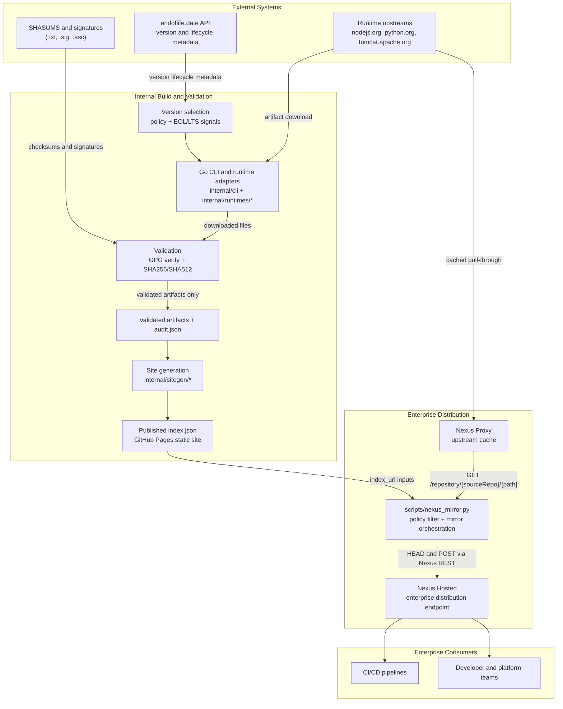

# Enterprise Runtime Supply Chain Architecture

This document explains the enterprise runtime supply chain from version discovery to internal artifact distribution.

## Technical Design Summary

### What are we doing?

We provide a controlled runtime distribution pipeline that:

- discovers approved runtime versions,
- downloads and validates runtime artifacts,
- publishes a canonical `index.json`,
- and serves artifacts to enterprise consumers through Nexus.

### Why are we doing this?

Enterprise teams need secure, auditable, and repeatable runtime consumption.

This design gives us:

- policy-driven version governance (supported/LTS/EOL-aware),
- cryptographic integrity validation (GPG + checksums),
- a trusted internal endpoint (Nexus Hosted),
- and machine-consumable metadata for automation.

### How are we doing this?

1. Discover versions via endoflife metadata + local policies.
2. Download and validate artifacts in Go (GPG + SHA256/SHA512 + audit records).
3. Publish validated artifact metadata as `index.json`.
4. Mirror approved artifacts from Nexus Proxy to Nexus Hosted via `scripts/nexus_mirror.py`.
5. Serve internal CI/CD and platform users from Nexus Hosted.

## High-Level Enterprise Diagram

## Phase-by-Phase Flow

### Phase 1: Version Discovery

- Endoflife metadata provides runtime lifecycle status and release context.
- Local policy files decide what is allowed for enterprise use.

### Phase 2: Artifact Acquisition and Validation (Go)

- Runtime adapters download binaries and companion metadata.
- Validation includes signature verification and checksum verification.
- Audit records are generated for traceability.

### Phase 3: Index Generation

- `internal/sitegen` emits `index.json` from validated artifacts.
- `index.json` is published for downstream automation and mirroring.

### Phase 4: Nexus Distribution

- Nexus Proxy caches upstream artifacts.
- `scripts/nexus_mirror.py` reads `index.json`, applies policy filters, checks existence, downloads selected items, and uploads into Nexus Hosted.
- Nexus Hosted becomes the internal enterprise distribution source.

### Phase 5: Enterprise Consumption

- CI/CD and internal users consume from Nexus Hosted.
- Direct external consumption can exist, but enterprise usage is governed through Nexus.

## External Integrations

This architecture depends on three external integration types:

- **Lifecycle metadata source**: endoflife provides release and maintenance status, helping us choose supported versions.
- **Artifact source systems**: runtime vendor sites provide binaries plus checksum/signature files used for verification.
- **Enterprise artifact platform**: Nexus provides controlled internal distribution after policy and integrity checks.

In short:

- endoflife helps decide **what version** to use,
- upstream vendors provide **what to download**,
- and Nexus controls **how enterprise teams consume** approved artifacts.

## index.json Consumption Contract

`scripts/nexus_mirror.py` consumes platform groups (`linux`, `mac`, `windows`) and maps each entry:

- `binary` -> destination path (`dest_path`)
- `source_path` -> source path (`binary` fallback when missing)
- `sha256` -> mirror-time integrity check
- `version` -> policy prefix match where `supported == true`

Current configured index URLs:

- `https://clean-dependency-project.github.io/cdprun/simple/nodejs/index.json`
- `https://clean-dependency-project.github.io/cdprun/simple/tomcat/index.json`
- `https://clean-dependency-project.github.io/cdprun/simple/python/index.json`

URL pattern:

- `https://clean-dependency-project.github.io/cdprun/simple/{runtime}/index.json`

Selection behavior:

- `HEAD 200` -> skip
- missing or non-200 -> select
- selected item -> download -> checksum validate -> upload

## Validation Model and Trust Boundaries

### Layer 1: Authoritative validation in Go

- Performs GPG verification with embedded keys.
- Performs SHA256 or SHA512 checksum verification by runtime.
- Produces audit artifacts.
- Feeds only validated artifacts into generated `index.json`.

### Layer 2: Distribution-time checks in mirror

- Re-checks SHA256 before upload.
- Applies policy and destination existence checks.
- Does not re-run GPG verification.

Trust boundary:

- Go acquisition pipelines establish cryptographic provenance.
- Mirror pipeline enforces enterprise distribution controls.

## Output Separation

`scripts/nexus_mirror.py` output streams are intentionally separated:

- **stdout**: final JSON result
- **stderr**: structured JSON logs

This prevents logs and command output from colliding.
